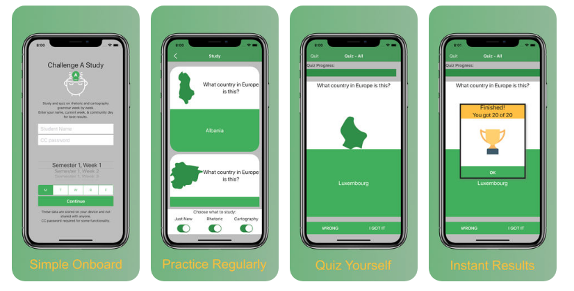

# Challenge Study
 

## Status
The application is in beta testing. It will be released for consumption very soon. 

## Intended Use
This application is intended to help Challenge A students with repetition and memorization. Several points of the curriculum include memorization, and students may want variety from index cards. Challenge A Study provides symbolic rewards for mastering individual grammar items (in the form of stars) and for mastering random groupings of grammar items (in the form of quiz trophies). 

While students could create their own interactive flashcards on other platforms, the Challenge A Study application is week aware, allowing students to see only those grammar items that are already part of their assignments. In both study and quiz modes, students can focus on the current week's new challenges or practice including all previous weeks. 

## Features
+ Week by Week grammar for Challenge A
+ Study mode where questions and answers are shown together with filters for the current week and subject
+ Quiz mode where 20 random questions are presented. The student can filter which grammar from which they will be drawn.
+ Symbolic rewards in the form of trophies and stars on the main page to remind students of their progress and successes
+ All local data, works offline and no student data is ever collected or shared 
+ Simple to get started - just pick your week and community day during onboarding
+ Simple to edit, use the settings. This is useful for holidays and breaks where the actual week may not be as calculated by the application. 

## Issues
If you have an issue or concern with the application, please submit an Issue here.

## Credits
No application is an island.

### Curriculum
The author does not own or imply ownership of the week by week curriculum that is developed by Classical Conversations, who own all rights to the material. This application is another form of study material.

### Images
This project depends on art by a lot of great people who make their art available on [Flaticon](https://www.flaticon.com/). 

+ Main Icon (Head with Lightbulb): Eucalyp from Flaticon with author modifications
+ Trophy: designed by Vectors Market from Flaticon
+ Star: designed by SmashIcons from Flaticon
+ Country Outlines: Countricons by [Freepik](https://www.freepik.com/) on Flaticon
